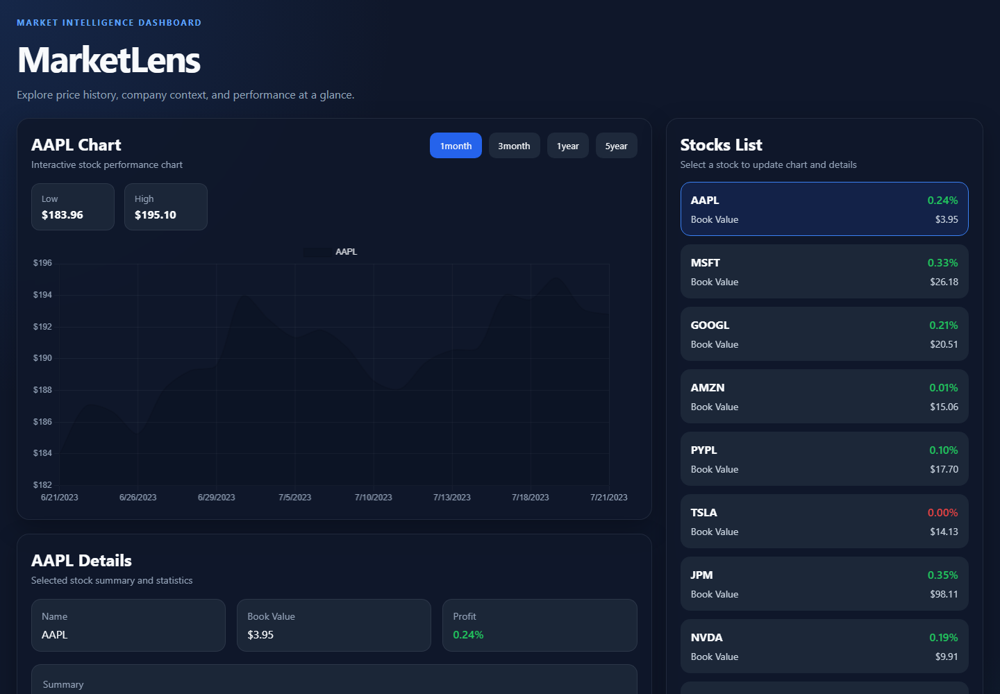

# MarketLens

A responsive stock-market dashboard that turns live API data into interactive price charts, company profiles, and portfolio-style comparisons.



## Features

- Compare ten widely followed public companies
- Switch between one-month, three-month, one-year, and five-year ranges
- Interactive Chart.js line visualization
- High and low values for the selected period
- Company profile and performance summary
- Profit and book-value comparison list
- Loading and error states for a remote API that may cold-start
- Responsive desktop and mobile layouts

## Tech stack

- React 19
- Vite
- Chart.js and react-chartjs-2
- Modern CSS with responsive grid layouts
- REST API hosted on Render

## Live data

The frontend consumes:

```text
https://stock-market-api-k9vl.onrender.com/api
```

The API base URL is configurable with `VITE_API_BASE_URL`.

## Run locally

```bash
npm install
copy .env.example .env
npm run dev
```

Open `http://localhost:5173`.

## Verification

```bash
npm run lint
npm run build
```

## Design decisions

- API calls load in parallel to minimize initial wait time.
- Response normalization tolerates the API's wrapped and unwrapped payload formats.
- Derived chart data is memoized and recalculated only when the stock or range changes.
- Remote-service failures are surfaced as a dedicated UI state rather than leaving a broken dashboard.
